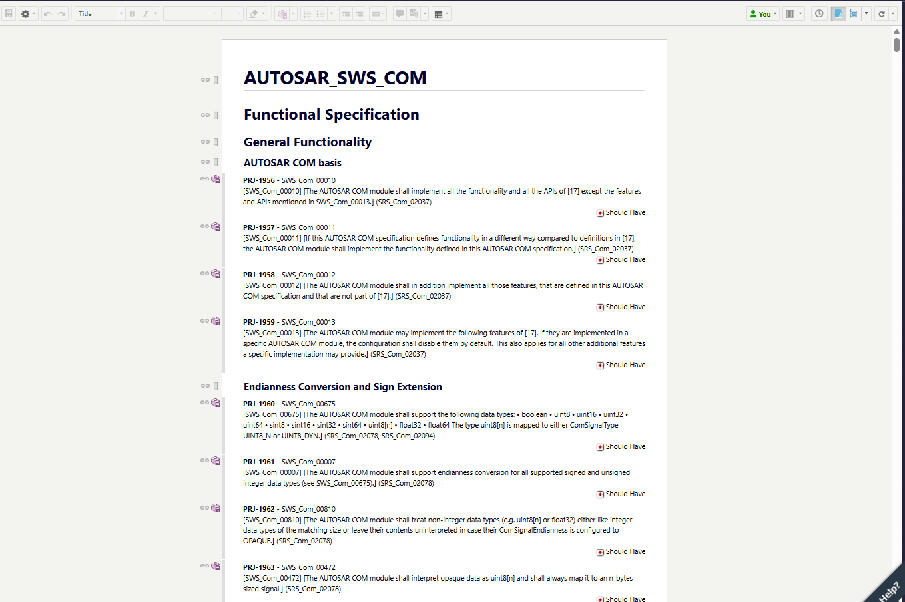
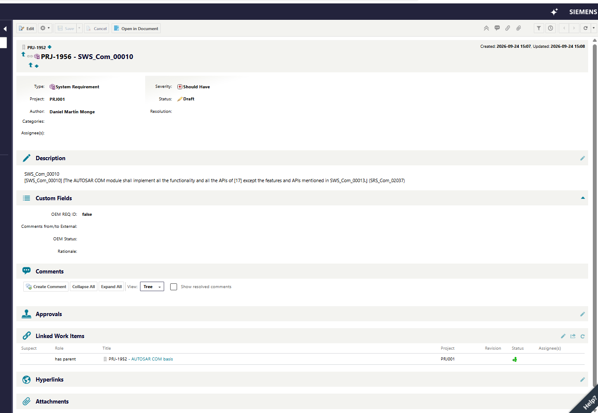

# reqif-extractor · PDF → ReqIF for Polarion

*Read this in [Español](README.es.md).*

Turns a specification PDF into a ReqIF file that imports into Polarion with the document's own hierarchy, its identifiers taken verbatim, and every item in the position it had on the page. The model reads; the code decides what an identifier is, what is informative, and in which order things go. No data in this repository.

> AI carries risk. Code bounds it. The standard answers for what remains.

[Design philosophy](#design-philosophy) · [Why AI here](#why-ai-here) · [The five steps](#the-five-steps-in-this-project) · [Measured](#measured) · [Demo](#demo-in-four-commands-public-data) · [Limitations](#limitations) · [Security & regulation](#security--regulation)

---

## Design philosophy

Every AI application has five steps. Only step 4 invokes a model; the other four are code: reproducible, testable, offline. Step 5 never patches: it flags and degrades. Full text at [epifaneia.dev](https://epifaneia.dev).

```
 1 CLEANING      2 CONTEXT       3 INPUT GUARDRAIL   4 PROCESS        5 OUTPUT GUARDRAIL
 ■ code          ■ code          ■ code              ▲ model          ■ code
```

## Why AI here

Any assistant can read a specification PDF and list its requirements as text. What none of them can do credibly is hand you the file Polarion accepts: identifiers taken verbatim, the document's hierarchy, items in page order, one XHTML root per value, every reference resolved. That is where the value is, and it is the pair that produces it: the model finds the items in any layout, in paragraphs, table rows or figures, and the output guardrail turns that list into a ReqIF that imports. A list in a notebook is a starting point. A file that imports on the first attempt is the deliverable.

---

## The five steps in this project

★ marks where the improvement lives in this project: the **output guardrail**. The model classifies well; what it cannot be trusted with is inventing identifiers, dropping the "information only" marker, or reordering. Three deterministic guards fix exactly those three things.

| Step | What it does here | |
|---|---|---|
| 1 · Cleaning | `s1` runs docling once: PDF → markdown, plus the layout's own regions (figures and tables, with page and bounding box). Tables are rebuilt from the vector text with gmft, no vision. Figures are cropped. Anything the layout did not see is caught by an orphan check: an id-shaped string in the text that nothing captured sends that document to a full-page fallback. | |
| 2 · Context | `s2` parses headers deterministically from the markdown (number, level, anchor). The model will receive the document already structured, and will attach every item to a header anchor instead of describing where it is. | |
| 3 · Input guardrail | Every model call carries a response schema. `s3` extracts items with `type ∈ {requirement, information}` and `parent_header ∈ known anchors`. `s4` asks for table rows as sentences and forbids the model, in the schema and in the prompt, to fill an identifier the row does not literally carry: an empty string is the correct answer. | |
| 4 · Process | Pass A: one text call per document on the markdown. Pass B: routed by region, tables as text and figures as image crops in batches, `gemini` or a local VLM under the same contract. Twenty times cheaper than sending the whole PDF to vision, same recall. | |
| 5 · Output guardrail | `utils/id_policy`: an identifier is accepted only if it is **verbatim** in the document; otherwise it is **derived** from the table's own id and the row (`SWS_Com_00347.3`), or **anchored to the page** (`TBL-P31.4`) in a form that cannot be confused with a real one, or **rejected** and reported. `s5c_infoguard` reconciles `type` against the source's own "(information only)" marker. `s5b_positions` audits order and hierarchy against the PDF. `s5_merge` dedups by id, deterministic. `s6` builds the ReqIF from a Polarion template with one `<xhtml:div>` root per value and every reference resolved. | ★ |

## Measured

Numbers come from a run over 12 real specification documents of one manufacturer (confidential, not included) and are reproduced on public documents in the demo below.

| What | Number | Where it comes from |
|---|---|---|
| Identifiers the model invented on the table route, before the policy | **167 of 170** rows | Row numbering mimicking the document's convention, colliding with real ids (`…-7` vs `…-007`) |
| Identifiers that changed between two runs on the same PDF, before the policy | **49 of 214** | Not reproducible. After the policy: 0 |
| Items misclassified as requirement that the source marked "information only" | **17** in 12 documents | Recovered by `s5c_infoguard` against the source marker |
| Cost of pass B, region routing vs whole-PDF vision | **~1/20** | Same recall; whole-PDF vision was ~1 € per 100 pages |
| Documents passing the five structural checks against a Polarion-imported reference | **12 / 12**, 2,695 references resolved, 0 orphans | XML well-formed, spec types identical, one div root, references resolved, per-document id prefix |

## Polarion

Public data in a Polarion trial: the AUTOSAR SWS COM specification, 465 items and 217 headings extracted from the PDF and imported in one attempt. Nothing to redact.

*The import mapping: headings to Heading, items to System Requirement, `ReqIF.Text` to Description, `ReqIF.ForeignID` to Title.*


*The document after import: the PDF's own hierarchy, every item under its heading, every title the verbatim `SWS_Com_…` identifier.*



*One requirement: identifier, text, and its parent heading as a link.*



## Demo in four commands (public data)

AUTOSAR specifications are public and use exactly the pattern this engine was built for: identifiers in brackets at the end of each item. NIST SP 800-171 is public domain.

```bash
pip install -r requirements.txt
cp .env.example .env                         # GEMINI_API_KEY, or VLM_BACKEND=local
# drop AUTOSAR_SWS_COM.pdf (autosar.org) and NIST_SP_800-171r2.pdf (nist.gov) in data/inputs/
python run.py                                # s1 → s6, all documents, in parallel
python tools/crop_ids.py && python tools/sanitize_reqif.py     # Polarion-ready variants
```

Output: `data/outputs/reqif/v1_nested/<doc>.reqif`. This repository ships no data; `data/` is ignored by git.

## Limitations

- Items of `type=information` are still emitted as requirement work items, explicitly marked `(information only)` in the visible text. Mapping them to Polarion's native Info type is pending.
- The vision pass still has noise: a false positive with a new id enters the file. `id_policy` rejects the invented ones; it cannot reject a real-looking one that is simply wrong.
- Two backends for the model, both in use. Which one to pick depends on the document, not on the engine:

  | | Cloud (`gemini`) | Local VLM (`vlm_local`) |
  |---|---|---|
  | Where the data goes | Leaves the machine: document markdown, table rows, figure crops | Stays on the machine |
  | Hardware | None | A GPU that fits the model |
  | Cost | Per token; ~1/20 of whole-PDF vision after region routing | Electricity |
  | Use it for | Public or non-confidential specifications | Documents that cannot leave the building |
  | Default today | Yes | `VLM_BACKEND=local` |
- `reference/gold.reqif`, a file that imported correctly into Polarion, is optional and not included: it depends on your project's template.
- Identity, events and sign-off are shipped as a contract with a local default (environment variable, JSONL file, HMAC key). The adapters to a company's Entra ID, SIEM or PKI are not here and cannot be tested here: see [docs/INTEGRATION.md](docs/INTEGRATION.md).

---

## Security & regulation

Same four headings in every repository. Rows marked **today** are what the code does. Rows marked **wire** are the three integration wires the repository ships as a contract (identity, events, sign-off) and the company connects to its own systems: see [docs/INTEGRATION.md](docs/INTEGRATION.md). Local tests: `python tests/test_custodia.py`.

| | | |
|---|---|---|
| **Confidentiality** | This engine sends document text and region crops to a cloud model by default (`GEMINI_MODEL`), so it is for **non-confidential specifications**, or for a local VLM (`VLM_BACKEND=local`) when the document cannot leave the building. What leaves, when it leaves: the markdown of the document in pass A, table rows as text and figure crops in pass B. `.env` and `data/` are outside git. | **today** |
| | Local route by default, cloud as the exception that has to be switched on. Not done yet: today the default is cloud, and the ledger records every call that leaves. | **next** |
| **Traceability** | Every item carries its origin: page, header anchor, source of the id (verbatim, derived, page-anchored), and the reconciliation flips of `infoguard` are reported per document. `s5b_positions` writes an audit of order and hierarchy against the PDF. | **today** |
| | **Wire 2 · events.** Every model call goes through `custodia/ledger`: one JSON line with actor, step, engine, endpoint, whether data left the machine, input size and hash. Never the text. `logs/custody.jsonl` or stdout. The company points its SIEM at it. | **wire** |
| **Leak prevention** | The model holds no credentials; the client holds the endpoint. Identifiers are never contaminated by markers or prefixes that could leak into downstream tools: `AD-FullID` / `AD-ReqID` stay clean. | **today** |
| | **Wire 1 · identity.** `run.py` refuses to start without a named actor (`custodia/identity`, default `CUSTODIA_ACTOR`); the actor is stamped on every event and every signature. The company replaces the provider with Entra ID, LDAP, Kerberos or its SSO in one call. Per-layer permissions on inputs, intermediates, model and outputs are the company's, on its file system and its vault. | **wire** |
| **Human in the loop** | Rejected identifiers and reconciliation flips are reported, never silently applied. The nested variant is the only one recommended for import; the flat one is opt-in with its risks written down. | **today** |
| | **Wire 3 · sign-off.** An output is a proposal until `tools/signoff.py sign` writes its manifest (file hash, actor, timestamp, signature) and `verify` passes; a changed file or a wrong key fails. Nothing the model touched is imported without a manifest that verifies. The company replaces the local HMAC key with its PKI or its Polarion approval workflow by registering two functions. | **wire** |

Framework: EU AI Act (2024/1689) · GDPR · ISO/IEC 42001 · ISO/IEC 27001 · TISAX.

---

## Structure

```
pipeline/    s1..s6 (+ s5b positions, s5c infoguard, s4_legacy_fullpage fallback)
clients/     gemini · vlm_local · docling_adapter        templates/  polarion_template.reqif
prompts/     requirements_extraction.txt · rescue_audit.txt
tools/       crop_ids · sanitize_reqif · survey_regions · verify_positions · signoff
utils/       id_policy · orphans · ids · md_headers · json_helpers
custodia/    identity · ledger · signoff · cli  — the three integration wires
docs/        ARCHITECTURE_v5.md · PLAN_robust.md · RISK_polarion.md · INTEGRATION.md
data/        inputs · interim · outputs — all outside git
```

Daniel Martín · [epifaneia.dev](https://epifaneia.dev) · Apache-2.0
